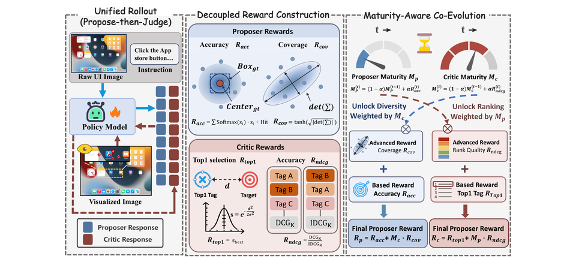

We are happy to share that **COPC** (*Co-evolutionary Framework of Proposer and Visual Critic*) has been accepted to **ACL 2026**.

GUI grounding is a core capability for autonomous agents: given a natural-language instruction and a screenshot, the model must output the exact pixel coordinates to click. Multimodal LLMs have made strong progress on semantic understanding, but precise localization remains difficult — especially on high-resolution screens with dense, visually similar UI elements.

A revealing pattern emerges from Pass@k analysis: while single-shot accuracy (Pass@1) plateaus, **Pass@k rises sharply** as more candidates are sampled. The model often *knows where to look* but cannot commit to a single precise click. The challenge is not missing the target entirely, but **selecting the right point from a dispersed output distribution**.

## Why geometric self-consistency falls short

A natural next step is test-time aggregation — take multiple samples and fuse them with geometric rules such as arithmetic mean, coordinate-wise median, geometric median, or medoid. In GUI grounding, however, these strategies often help little or even hurt:

- Predictions are **continuous and high-variance**, so clustering rarely forms a reliable consensus.
- Coordinates can be **multi-modal** (e.g., vacillating between two adjacent buttons); averaging collapses them into invalid background regions.
- Geometric methods are **semantically blind** — they cannot tell a precise click on the wrong button from an imprecise click on the right one.

Simply sampling more does not fix the problem if the final selection mechanism cannot reason about *which* candidate matches the instruction.

## COPC in one idea: propose, visualize, then critique

COPC shifts GUI grounding from blind coordinate regression to a **Visual Perception Ranking** paradigm inspired by the human "scan-and-select" process:

1. **Propose** — a single MLLM, prompted as a *Proposer*, generates $K$ diverse candidate coordinates in one inference pass.
2. **Visualize** — candidates are rendered onto the screenshot with distinct markers, turning an abstract regression problem into a concrete visual discrimination task.
3. **Critic** — the same model, now acting as a *Critic*, ranks the marked candidates and selects the top one as the final click.

This Propose-then-Critic pipeline exploits the model's stronger discriminative ability to verify its own proposals, rather than relying on fragile geometric fusion.

## Co-evolving the Proposer and Critic with RL

Off-the-shelf MLLMs exhibit a **grounding–critic gap**: they can generate plausible candidates but struggle to rank the correct target among semantic distractors (nearby valid UI elements that look clickable but do not match the instruction). Standard SFT is data-hungry and does not cultivate this self-critique ability; naive RL often collapses exploration diversity, undermining the very Pass@k potential we want to unlock.

COPC addresses this with a **maturity-aware co-evolutionary reinforcement learning** strategy built on GRPO. The Proposer and Critic receive **decoupled reward signals**:

| Role | Rewards | What they encourage |
| --- | --- | --- |
| **Proposer** | Accuracy ($R_{acc}$) + Coverage ($R_{cov}$) | Hitting the target *and* exploring diverse spatial candidates |
| **Critic** | Top-1 selection ($R_{top1}$) + Ranking quality ($R_{ndcg}$) | Picking the best candidate *and* ordering the full list correctly |

The key is a **maturity-aware dynamic weighting** mechanism. As training progresses, exponential moving averages of Proposer accuracy and Critic NDCG track each role's maturity ($C_P$, $C_J$). Coverage and ranking rewards are scaled by the *other* role's maturity:

$$\mathcal{R}_{\text{Proposer}} = R_{acc} + C_J \cdot R_{cov}, \quad \mathcal{R}_{\text{Critic}} = R_{top1} + C_P \cdot R_{ndcg}$$

This creates a symbiotic curriculum:

- **Early stage** — the system prioritizes basic localization before encouraging wide exploration.
- **Later stage** — as the Critic matures, the Proposer is rewarded for broader spatial coverage; as the Proposer improves, harder negatives train finer-grained Critic discrimination.

The Proposer progressively supplies harder distractors; the Critic, in turn, gives the Proposer a reliable safety net to explore aggressively without mode collapse.

## Experiments

We train on data from Widget Caption, OmniAct, GUICourse, ShowUI, RICO-SCA, and OS-ATLAS, and evaluate on **six benchmarks**: MMBench-GUI, ScreenSpot-Pro, ScreenSpot-v2, UI-I2E-Bench, UI-Vision, and OSWorld-G. Two metrics decouple generation from selection:

- **Oracle@5** — does at least one of the $K$ proposals hit the ground-truth bounding box? (Proposer recall)
- **Top-1 Accuracy** — does the Critic's top-ranked choice hit the target? (end-to-end performance)

**Key results on Qwen3-VL-4B** (vs. GRPO and other training paradigms):

| Benchmark | Ours Oracle@5 | Ours Top-1 | GRPO Top-1 |
| --- | ---: | ---: | ---: |
| ScreenSpot-Pro | 59.8 | **56.4** | 53.4 |
| ScreenSpot-v2 | 93.1 | **92.6** | 92.5 |
| OSWorld-G | 63.2 | **59.4** | 57.3 |
| MMBench-GUI | 84.5 | **79.3** | 75.7 |
| UI-I2E-Bench | 80.6 | **76.0** | 72.6 |

COPC consistently achieves the **smallest gap** $\Delta$ between Oracle@5 and Top-1 across benchmarks, meaning the Critic effectively closes the loop from diverse proposals to precise selection. Compared with the base model, grounding capability improves by up to **17.2%** relative.

Against spatial consistency baselines (8 independent runs + geometric aggregation), COPC generates multiple candidates in a **single pass** followed by one critic turn — substantially lower token cost — while still outperforming arithmetic mean, median, geometric median, and medoid.

The framework also transfers across backbones: on Qwen3-VL-8B, COPC reaches **58.7%** on ScreenSpot-Pro and **59.6%** on OSWorld-G, surpassing strong GUI-specific baselines; similar gains hold on UI-TARS-1.5-7B.

**Ablation highlights** (Qwen3-VL-4B, averaged across benchmarks):

| Variant | Oracle@5 | Top-1 | $\Delta$ |
| --- | ---: | ---: | ---: |
| Full COPC | **70.0** | **67.3** | **-2.7** |
| w/o Maturity (static weights) | 62.6 | 57.5 | -5.1 |
| w/o Coverage Reward | 66.7 | 63.2 | -3.5 |
| w/o Ranking Reward | 69.3 | 64.9 | -4.4 |

The maturity mechanism is the most critical component — without adaptive weighting, the optimization conflict between accuracy and diversity leads to the largest performance drop.

## Takeaway

GUI grounding need not be a one-shot regression gamble. COPC shows that when models already encode correct targets in their Pass@k distribution, the right question is not *how to average coordinates*, but *how to teach the model to see and judge its own proposals*. By co-evolving a coverage-oriented Proposer and a visually grounded Critic under maturity-aware RL, COPC turns latent sampling potential into reliable pixel-level clicks — a practical step toward robust autonomous GUI agents.

## Further reading

- Paper: [Measure Twice, Click Once (ACL 2026)](https://arxiv.org/abs/2604.21268)
