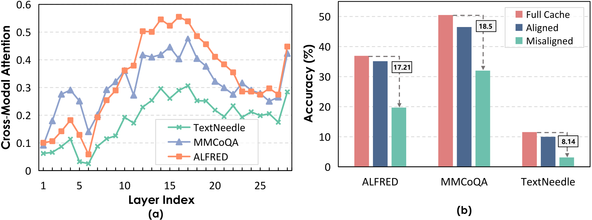
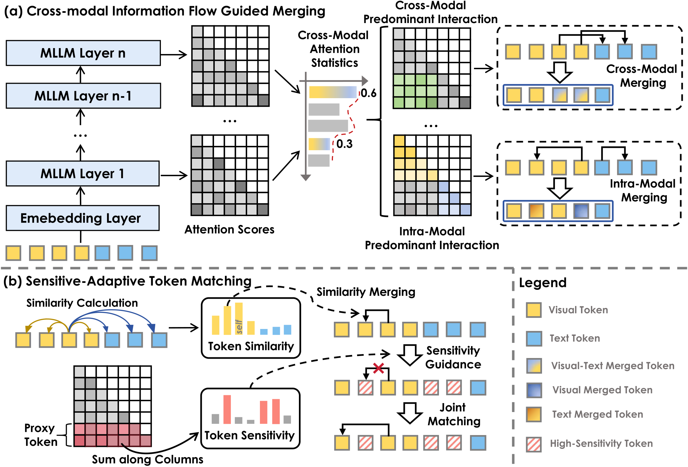
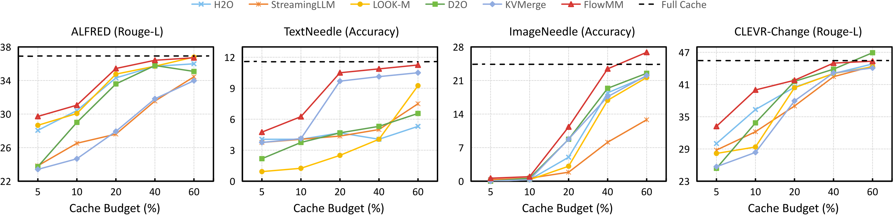

We are happy to share that **FlowMM** has been accepted to the **EMNLP 2026 Main Conference**.

Multimodal large language models keep key and value states for long text and many visual tokens. As context grows, this KV cache becomes a major memory and decoding bottleneck. Eviction saves memory by deleting entries, but can remove information that later reasoning still needs. Merging is less destructive, yet a single similarity rule across every layer can mix visual and textual states before their semantics are ready to be combined.

FlowMM treats compression as an **information-flow alignment** problem. It observes how visual and textual tokens interact at each layer, selects a matching merge strategy for that layer, and protects task-sensitive tokens from risky consolidation.

## Why static merging breaks multimodal context

Cross-modal interaction is not uniform across model depth:

- **Shallow layers are mostly intra-modal.** Visual and textual tokens are still developing modality-specific representations, so premature cross-modal merging can cause semantic confusion.
- **Deeper layers become more cross-modal.** Once heterogeneous tokens exchange more attention, cross-modal merging can consolidate shared context effectively.
- **Alignment matters.** Applying the opposite strategy at each stage sharply degrades performance, even when the cache budget stays unchanged.

Across ALFRED, MMCoQA, and TextNeedle, flow-aligned merging remains close to the full cache. Misaligned merging loses **17.21**, **18.5**, and **8.14** points, respectively, relative to full-cache performance. The result suggests that deciding *how* to merge is as important as deciding *which* tokens to retain.

## FlowMM in one pass

FlowMM combines two coordinated ideas:

1. **Measure cross-modal information flow.** For each layer, FlowMM computes the share of attention exchanged between visual and textual tokens.
2. **Choose a layer-specific merge strategy.** Layers with limited cross-modal interaction merge within each modality; layers with strong interaction can merge across modalities.
3. **Estimate token sensitivity.** A small set of task-proximal proxy tokens identifies states that strongly influence the current response.
4. **Match safely.** Similar low-sensitivity tokens are merged into important pivot tokens, while high-sensitivity states are protected from consolidation.

The complete procedure is **training-free** and **plug-and-play**. It adapts the compression pattern during inference without fine-tuning the underlying multimodal model.

## Performance at a 20% cache budget

We evaluate FlowMM on seven MileBench tasks with three different multimodal backbones. All compressed methods retain the same 20% cache budget.

| Backbone | Full cache average | Best compressed baseline | FlowMM |
| --- | ---: | ---: | ---: |
| Qwen2.5-VL-7B | 32.44 | 27.72 | **30.37** |
| InternVL2.5-8B | 27.97 | 26.06 | **27.85** |
| MobileVLM-V2-3B | 12.99 | 11.07 | **12.32** |

FlowMM is the strongest compressed-cache method on the average score for all three backbones. On InternVL2.5-8B, it stays within **0.12 points** of the full-cache average while using only 20% of the cache. On Qwen2.5-VL-7B TextNeedle, it improves by **5.31 points** over the strongest eviction baseline.

## Robustness across cache budgets

FlowMM remains effective from a 5% to 60% cache budget. On TextNeedle, its 20% configuration outperforms eviction-based methods retaining 60% of the cache. At a 40% budget, it approaches full-cache performance across the evaluated tasks, while at 60% it can even surpass full caching on ImageNeedle.

## Speed and memory

The efficiency measurements use one NVIDIA A100 GPU and average 20 randomly sampled examples.

| Cache budget | Decoding latency | KV-cache GPU memory |
| ---: | ---: | ---: |
| Full cache (100%) | 29.08 ms/token | 2.06 GiB |
| 50% | 23.04 ms/token | 1.05 GiB |
| 35% | 19.18 ms/token | 0.74 GiB |
| 20% | 17.35 ms/token | 0.44 GiB |
| 5% | **15.81 ms/token** | **0.13 GiB** |

At the most aggressive measured setting, FlowMM reduces KV-cache memory from **2.06 GiB to 0.13 GiB** and cuts per-token latency from **29.08 ms to 15.81 ms**. Across the evaluated configurations, this corresponds to an **80–95% memory reduction** and approximately **1.3–1.8× decoding speedup** while maintaining competitive task performance.

## Takeaway

Multimodal KV-cache compression should respect how information moves between modalities and across layers. FlowMM aligns merging with that flow, then uses sensitivity-aware matching to preserve the states that matter most. The result is a simple inference-time method that makes long multimodal contexts substantially more memory- and latency-efficient without retraining the model.

## Further reading

- **Paper:** [FlowMM on arXiv](https://arxiv.org/abs/2511.05534)
- **Submission record:** [FlowMM on OpenReview](https://openreview.net/forum?id=LiLo7o0Kjs)
