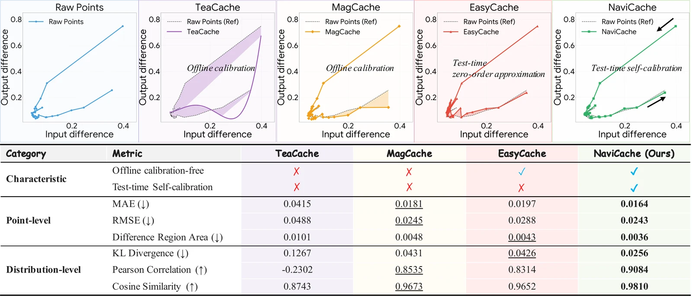
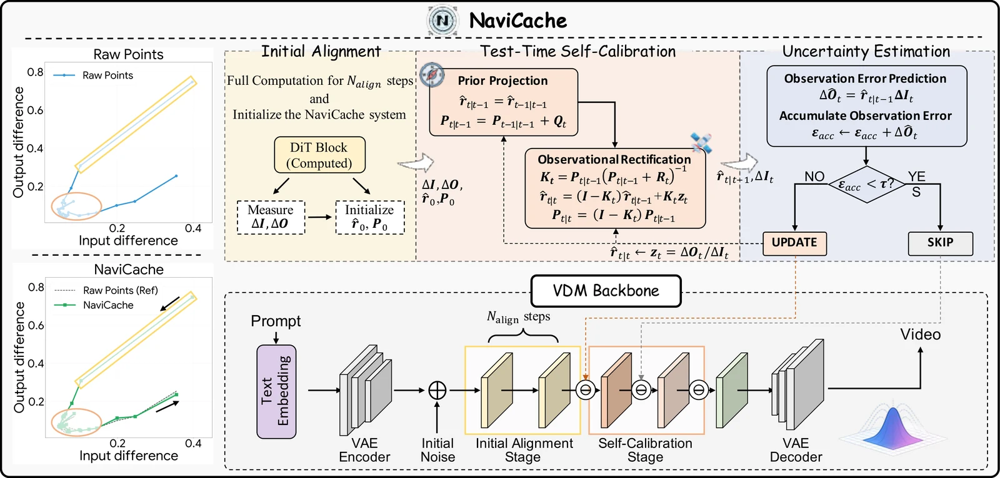
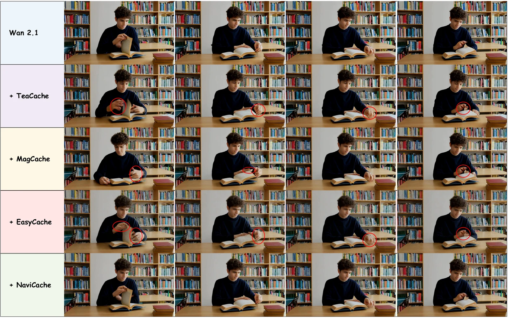

We are happy to share that **NaviCache** has been accepted to **ICML 2026**.

Video diffusion models (VDMs) such as HunyuanVideo, Wan, and Open-Sora can produce stunning results, but their iterative sampling process requires dozens of forward passes through massive architectures — a computational tax that blocks real-time deployment. Feature caching promises to skip redundant computation, yet existing methods face a dilemma: **offline calibration-based** approaches (TeaCache, MagCache) need curated calibration sets, hours of fitting, and break under distribution shift; **offline calibration-free** approaches (EasyCache) avoid calibration but rely on an instantaneous zero-order approximation that lags behind the real feature dynamics.

NaviCache takes a different angle. When we visualize the relationship between input variations and output responses during denoising, it traces a manifold that looks like a **kinematic navigation track** — the feature evolution has momentum, not random jitter. So we reformulate caching as an **Inertial Navigation System (INS)** problem: track the feature-change ratio like a navigation system tracks a moving vehicle, and skip computation only when the accumulated estimation error stays within a provable bound.

## How NaviCache works

NaviCache is a plug-and-play framework with three key components:

1. **Initial Alignment** — like the stationary alignment phase of an inertial navigation system, the first few denoising steps are fully computed to calibrate the initial state estimate and its uncertainty covariance before "navigation mode" begins.
2. **Dual-state self-calibration engine** — a recursive Bayesian filter tracks both the feature change ratio and its estimation uncertainty. *Prior Projection* propagates the state forward with a process-noise model of the ratio's drift (its momentum); *Observational Rectification* fuses new ground-truth measurements with the prediction through an optimal Calibrated Fusion Factor.
3. **Uncertainty-aware safety gate** — an accumulated-error metric decides each step: **SKIP** (reuse the cached feature, dead reckoning) or **UPDATE** (run full computation, re-anchor the trajectory, and collapse the uncertainty).

This design is not just a heuristic — we prove that NaviCache achieves a **strictly lower estimation error bound** than the zero-order heuristics used by existing calibration-free methods, so it can skip more aggressively while preserving fidelity.

## Results

We evaluated NaviCache on **HunyuanVideo**, **Wan 2.1**, and **Open-Sora 1.2** against PAB, TeaCache, MagCache, and EasyCache on VBench:

- On **HunyuanVideo**, NaviCache-mid reaches a **2.17× speedup** with PSNR 32.65, outperforming EasyCache (2.15×, PSNR 32.53) at similar latency.
- On **Wan 2.1**, NaviCache-slow reaches **PSNR 25.10**, substantially higher than TeaCache (22.79) and MagCache (23.33).
- The skipping strategy adapts per prompt and remains stable across resolutions and video lengths (**1.81×–1.91×** on Open-Sora from 480p/51f to 720p/102f).
- The whole self-calibration engine costs only **0.0109 s** of overhead per generation — and zero offline calibration time (vs. 15,191 s for TeaCache).

In case studies, calibration-based methods suffer factual errors (deformed hands, lost textures) and zero-order methods show severe motion blur, while NaviCache maintains structural integrity and high-frequency details even in high-motion segments.

## Takeaway

NaviCache shows that control and navigation theory can be formally mapped onto diffusion dynamics: treat the feature-change ratio as a navigation state, track it with a dual-state filter, and let uncertainty — not a fixed schedule — decide when to compute. The result is acceleration that is simultaneously **calibration-free**, **adaptive**, and **theoretically grounded**.

If you are working on efficient video generation or diffusion serving, we would love to hear your feedback.

## Further reading

- Paper: [NaviCache on arXiv](https://arxiv.org/abs/2606.26795)
- Code & project page: [github.com/HelloZicky/NaviCache](https://github.com/HelloZicky/NaviCache)
