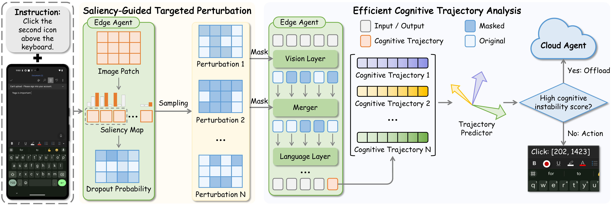

We are happy to share that **SPECTRA** has been accepted to **ACM MM 2026**.

GUI grounding maps a natural-language instruction to the coordinates of the correct UI element. Powerful cloud agents perform well, but sending every task to the cloud increases latency and cost. A practical device–cloud system should solve easy tasks locally and request cloud assistance only when the edge agent is likely to fail.

The challenge is that lightweight GUI agents can be **confidently wrong**. User interfaces contain tiny icons, repeated list items, and visually similar controls, so an incorrect coordinate may still receive high confidence. SPECTRA therefore asks a different question: rather than trusting what the agent reports, can we actively test whether its internal decision is stable?

## Cognitive instability

We observe that while edge agents may output coordinates with high confidence based on priors, their anchoring on critical visual cues is often fragile. An agent that truly understands the instruction establishes robust alignment between the target and the global GUI context, whereas a guessing or hallucinating agent may overfit to spurious visual correlations. Under minute perturbations, these fragile correlations collapse, causing significant drift in the agent's latent states. We call this behavior **cognitive instability**.

SPECTRA adopts an active introspection paradigm to expose this instability. Instead of passively observing the output distribution, it stress tests the agent's visual cognition and measures the dispersion of its hidden state trajectories. Greater topological divergence suggests unreliable grounding and triggers a request for cloud assistance before any coordinates are decoded.

## SPECTRA design

SPECTRA consists of two target designs:

1. **Saliency-Guided Targeted Perturbation** computes a norm saliency map during visual reasoning to identify visual anchors—the GUI regions activated by the edge agent for prediction. A sliding window preserves local spatial continuity, after which independently sampled binary masks are injected into selected layers of the visual encoder and the merger module to simulate diverse cognitive stress tests.
2. **Efficient Cognitive Trajectory Analysis** performs a batch of parallel forward passes during the prefill phase. From these passes, it extracts the hidden states of the last token from the penultimate language model layer as cognitive trajectories in a high dimensional space, then uses a lightweight transformer-based predictor to quantify their topological divergence.

During deployment, the score produced by the predictor is compared with a threshold to determine whether the edge prediction should be adopted or the task should be offloaded to the cloud. The threshold can also be adjusted dynamically when cloud availability changes.

## Main results and analysis

We evaluate SPECTRA on **MMBench-GUI**, **ScreenSpot-Pro**, and **UI-I2E-Bench**, using InfiGUI-G1-3B and Holo1.5-3B as edge agents and GTA1-32B as the cloud agent. AUC measures request decision discrimination, SRCC measures correlation between request scores and spatial grounding error, and AUCG measures collaborative gain across different request rates. The table below reproduces the paper's main results; **bold** denotes the best result and *italic* the second best. MMB and SSP abbreviate MMBench-GUI and ScreenSpot-Pro.

| Edge agent | Method | MMB AUC | MMB SRCC | MMB AUCG | SSP AUC | SSP SRCC | SSP AUCG | UI-I2E AUC | UI-I2E SRCC | UI-I2E AUCG |
| --- | --- | ---: | ---: | ---: | ---: | ---: | ---: | ---: | ---: | ---: |
| InfiGUI-G1-3B | Random | 51.05 | 1.86 | 52.30 | 49.90 | 1.62 | 48.69 | 47.69 | -4.26 | 47.22 |
| InfiGUI-G1-3B | LN-Confidence | 57.37 | 9.49 | 53.03 | 62.82 | 8.69 | 53.27 | 51.65 | -1.66 | 38.24 |
| InfiGUI-G1-3B | LN-Entropy | *63.11* | *17.82* | 57.21 | 65.08 | *16.77* | 53.62 | 54.60 | 4.03 | 48.84 |
| InfiGUI-G1-3B | CoT | 60.56 | 17.81 | 57.41 | 56.89 | 14.49 | 49.45 | *58.22* | *14.05* | *69.58* |
| InfiGUI-G1-3B | EigenScore | 55.77 | 8.38 | 56.02 | 56.86 | 10.08 | 52.15 | 53.90 | 5.95 | 53.29 |
| InfiGUI-G1-3B | Self-Consistency | 61.30 | 15.55 | *63.44* | *66.65* | 15.16 | **57.03** | 57.44 | 7.50 | 45.57 |
| InfiGUI-G1-3B | **SPECTRA (Ours)** | **74.57** | **35.44** | **68.40** | **69.15** | **36.72** | *56.32* | **67.29** | **22.60** | **71.39** |
| Holo1.5-3B | Random | 50.12 | -0.74 | 52.25 | 49.96 | -1.84 | 52.45 | 49.55 | -2.69 | 51.15 |
| Holo1.5-3B | LN-Confidence | 49.22 | -9.62 | 54.60 | 70.82 | 5.72 | 72.18 | 48.75 | -10.34 | 40.65 |
| Holo1.5-3B | LN-Entropy | *69.26* | *19.05* | *69.43* | **83.62** | **26.58** | **79.79** | *69.13* | *21.09* | *60.55* |
| Holo1.5-3B | CoT | - | - | - | - | - | - | - | - | - |
| Holo1.5-3B | EigenScore | 62.28 | 12.94 | 63.41 | 72.88 | 16.48 | 69.37 | 58.22 | 10.38 | 50.49 |
| Holo1.5-3B | Self-Consistency | 61.18 | 10.41 | 63.47 | 73.90 | 21.24 | *73.28* | 56.70 | 5.39 | 48.26 |
| Holo1.5-3B | **SPECTRA (Ours)** | **75.62** | **34.92** | **70.25** | *76.54* | *26.05* | 65.92 | **72.37** | **32.52** | **63.82** |

SPECTRA outperforms competing baselines across most request decision metrics. On MMBench-GUI with InfiGUI-G1-3B, it surpasses the strongest baseline by 11.46% in AUC and 17.62% in SRCC, demonstrating effective request decisions across edge agents and benchmarks.

For collaborative performance, SPECTRA achieves the highest AUCG on MMBench-GUI and UI-I2E-Bench with both edge agents. When paired with GTA1-32B, InfiGUI-G1-3B and Holo1.5-3B retain **93.44%** and **95.60%** of the cloud agent's performance at average request rates of **37.58%** and **39.24%**, respectively.

## Cost analysis

Benefiting from parallel prefill, SPECTRA maintains latency comparable to baselines that rely on outputs in the local execution path. In the cloud execution path, completing request assessment during prefill avoids costly local decoding and reduces edge latency by over **97%**. Baselines must generate complete response sequences before making a request decision.

| Perturbations ($N$) | Mean latency (s) | p95 latency (s) | Compute (TFLOPs) |
| ---: | ---: | ---: | ---: |
| 1 | 4.71 ± 0.35 | 5.26 | 14.99 ± 0.37 |
| 3 | 5.50 ± 0.37 | 6.19 | 44.98 ± 1.12 |
| 5 | 6.44 ± 0.46 | 7.07 | 74.97 ± 1.86 |
| 7 | 6.79 ± 0.37 | 7.39 | 104.95 ± 2.60 |

The table reports actual edge deployment costs on ScreenSpot-Pro with InfiGUI-G1-3B. p95 denotes 95th percentile latency. As $N$ increases, compute grows linearly while mean latency increases sublinearly. The mean latency at $N=5$ increases by only **36.7%** relative to $N=1$. The complete edge deployment occupies approximately **7.97 GB of VRAM**. The trajectory predictor adds only approximately **1.9 ms** of latency and **46 MB** of VRAM, making its practical overhead negligible.

## Takeaway

SPECTRA establishes an active introspection paradigm for edge agents by amplifying their inherent cognitive instability. Saliency-Guided Targeted Perturbation masks salient GUI regions to simulate visual cognitive stress, while Efficient Cognitive Trajectory Analysis quantifies the topological divergence of the trajectories without autoregressive decoding. The results demonstrate that SPECTRA provides reliable and efficient cloud request assessment, enabling edge agents to identify their capability boundaries and use cloud resources only when necessary.

## Further reading

- Paper: [SPECTRA (ACM MM 2026)](https://doi.org/10.1145/3767308.3836048)
