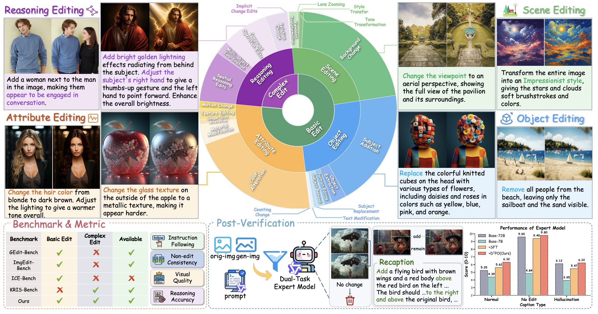
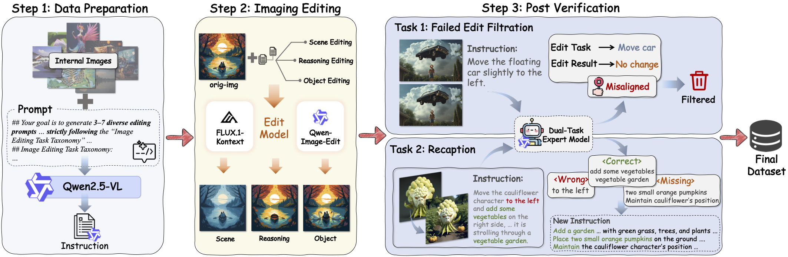
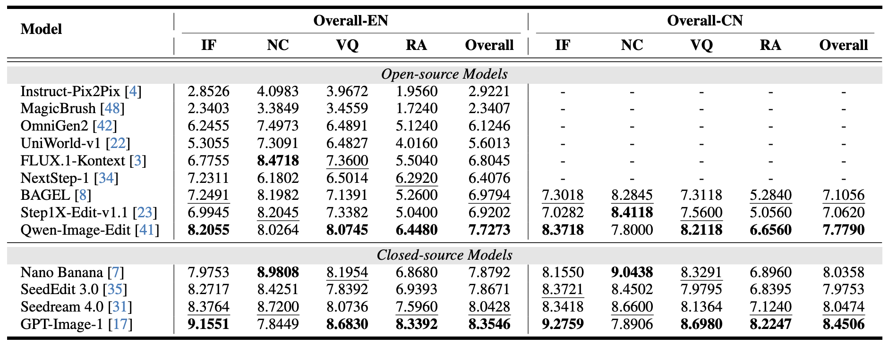

The image editing field is advancing rapidly, yet the performance gap between closed-source and open-source models keeps widening. The root cause lies in two persistent bottlenecks: **the scarcity of large-scale, high-quality training data** and **the lack of comprehensive benchmarks capable of diagnosing diverse model weaknesses**. Our work, **UnicEdit-10M**, directly tackles both — accepted at CVPR 2026.



## Three Core Contributions

### UnicEdit-10M Dataset

Existing data construction methods face a fundamental **scale-quality trade-off**: human annotations are high-quality but not scalable, while automated pipelines suffer from error propagation and noise.

Our solution replaces multi-stage toolchains with an **end-to-end editing model** combined with a unified post-verification stage. The pipeline consists of three stages:

1. **Data Preparation** — source image collection, classification, and preprocessing
2. **Image Editing** — edit triplet generation using an end-to-end editing model
3. **Post Verification** — filtering failed edits and recaptioning instructions for quality



The resulting **UnicEdit-10M** contains **10 million** editing triplets spanning 22 sub-tasks — extending well beyond basic edits to cover complex spatial transformations, viewpoint changes, and reasoning-enriched edits, while achieving state-of-the-art aesthetic quality compared to existing datasets.


### Qwen-Verify: A 7B Dual-Task Expert Model

To enable scalable quality control, we train **Qwen-Verify**, a 7B dual-task expert model jointly performing two tasks:

- **Failure Detection** — identifying and filtering out unsuccessful edits
- **Instruction Recaptioning** — rewriting low-quality instructions into precise, high-quality captions

Despite its smaller size, Qwen-Verify outperforms Qwen2.5-VL-72B on both tasks, delivering significantly better performance at a fraction of the computational and economic cost.

### UnicBench: A Comprehensive Evaluation Benchmark

**UnicBench** goes beyond standard editing evaluation by explicitly assessing spatial understanding and knowledge-driven reasoning. It introduces four metrics:

- **Instruction Following** — measures how well the edited image satisfies the instruction via a VLM-based cross-modal alignment score.
- **Non-edit Consistency** — assesses preservation of non-target regions, penalizing unintended changes outside the specified edit area.
- **Visual Quality** — instruction-conditioned assessment of naturalness, coherence, and adherence to the intended visual style.
- **Reasoning Accuracy** — targets knowledge-intensive edits: a VLM derives an intended-outcome specification from the instruction and original image; each sample provides a *reasoning-points* list (targets, operations, expected visual changes) to guide the verifier's attention when checking the edited image against the specification.

## Experimental Results

We conduct a comprehensive evaluation of mainstream image editing models on UnicBench, covering both English (EN) and Chinese (CN) instructions, evaluated by GPT-4.1.



Key findings from our analysis:

- All models struggle significantly on **reasoning-enriched editing** tasks that require world knowledge to infer the edit target.
- **Non-edit region preservation** is a universal weakness — edits frequently introduce unintended changes to surrounding areas.
- The performance gap between closed-source and open-source models is most pronounced on complex tasks, highlighting the impact of training data quality and scale.

UnicBench's fine-grained diagnostics provide clear directions for future research in image editing.

## Citation

If this work is helpful to your research, please consider citing:

```bibtex
@inproceedings{ye2026unicedit,
  title={Unicedit-10m: A dataset and benchmark breaking the scale-quality barrier via unified verification for reasoning-enriched edits},
  author={Ye, Keming and Huang, Zhipeng and Fu, Canmiao and Liu, Qingyang and Cai, Jiani and Lv, Zheqi and Li, Chen and Lyu, Jing and Zhao, Zhou and Zhang, Shengyu},
  booktitle={Proceedings of the IEEE/CVF Conference on Computer Vision and Pattern Recognition},
  pages={37279--37289},
  year={2026}
}
```
