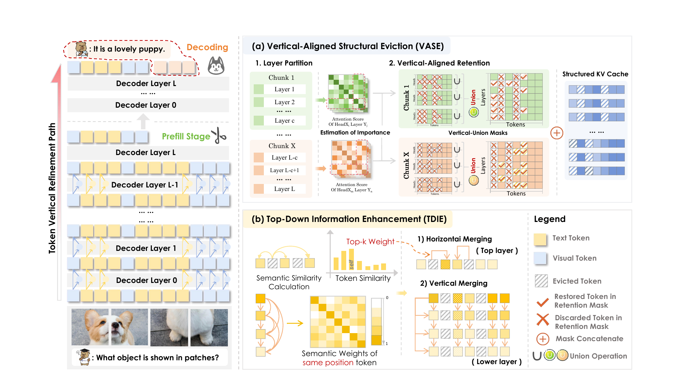

We are happy to share that **VertiKV** has been accepted to **ACM MM 2026** as an **Oral presentation**.

Multimodal large language models must retain key and value states for long textual contexts and high-resolution visual inputs. This KV cache grows with sequence length and quickly becomes a memory and decoding bottleneck. Existing eviction methods usually score and retain tokens independently at each attention head and layer. Although locally reasonable, those decisions create irregular cross-layer sparsity: a token kept in one layer may disappear in the next, interrupting the path along which its representation is refined.

VertiKV starts from a structural view of compression. Instead of asking only *which tokens matter in each layer*, it asks *which refinement paths must remain continuous across layers*. The method combines **Vertical-Aligned Structural Eviction (VASE)** with **Top-Down Information Enhancement (TDIE)** to preserve those paths and reuse residual context from evicted tokens.

## Why independent eviction breaks vertical integrity

Token importance changes across heads and layers, so independently generated retention masks have low overlap and form fragmented patterns. Our analysis shows that token representations nevertheless follow continuous vertical refinement trajectories: essential information accumulates from shallow to deep layers, with several stage boundaries visible across the network depth.

This suggests two design principles:

- **Continuity matters locally across depth.** A critical token should remain available while its representation is being refined within the same processing stage.
- **Alignment should remain compact.** Enforcing one global mask across every layer would retain too many tokens, so alignment should operate within local layer chunks that follow the stage-wise structure.

A plug-in experiment supports this view. Adding union retention to H2O at a 10% cache budget improves ALFRED Rouge-L by 2.92 points for an approximately 10-point increase in effective budget. With SnapKV at a 20% budget, the same idea improves Rouge-L by 2.8 points and approaches the performance of SnapKV at a 60% budget.

## VertiKV in one pass

VertiKV partitions the decoder into consecutive layer chunks and applies two coordinated components:

1. **VASE aligns retained tokens within each chunk.** Each layer first produces a local top-*K* mask from attention-based importance scores. VASE takes the element-wise union of those masks and applies the aligned result to every layer in the chunk. Any token considered critical by one layer therefore keeps a continuous refinement path throughout that local stage.
2. **TDIE enriches the retained cache.** At a chunk boundary, evicted representations are merged horizontally into semantically similar neighboring retained tokens. In lower layers, aligned upper-layer representations provide top-down signals that enhance the retained tokens through similarity-weighted merging.

VASE protects structure; TDIE compensates information. Together, they avoid treating eviction as pure deletion while keeping the compressed cache regular and efficient.

## Performance under aggressive compression

We evaluate VertiKV without additional training or fine-tuning on Qwen2.5-VL-7B, LLaVA-OneVision-1.5-8B, and Qwen3-VL-8B. The benchmark suite covers long-context retrieval, captioning, change understanding, multi-step visual reasoning, and visual question answering. All compressed-cache methods use a unified 20% cache budget.

| Backbone | Full cache average | Best compressed baseline | VertiKV |
| --- | ---: | ---: | ---: |
| Qwen2.5-VL-7B-Instruct | 0.4158 | 0.3753 | **0.4129** |
| LLaVA-OneVision-1.5-8B-Instruct | 0.4413 | 0.2791 | **0.3018** |
| Qwen3-VL-8B-Instruct | 0.4411 | 0.4037 | **0.4282** |

VertiKV is the strongest compressed-cache method on the average score for all three backbones. On Qwen3-VL-8B, it improves over the best compressed-cache baseline by **4.38 percentage points** on Text Needle and **7.82 percentage points** on Image Needle. At a 20% budget on Qwen2.5-VL-7B, VertiKV reaches **0.1250** on Text Needle, slightly exceeding the full-cache score of **0.1219**.

The method also remains robust as the retained budget shrinks. At a 10% budget, its Text Needle score of **0.0938** is more than twice SnapKV's **0.0406**. Across DocVQA and ALFRED, VertiKV stays close to full-cache performance over a broad range of budgets.

## Speed and memory

The efficiency measurements use a single NVIDIA A100 80 GB GPU with batch size 1.

| Cache budget | Decoding latency | KV-cache GPU memory |
| ---: | ---: | ---: |
| Full cache (100%) | 53.92 ms/token | 1.40 GiB |
| 40% | 43.92 ms/token | 0.69 GiB |
| 20% | 31.71 ms/token | 0.47 GiB |
| 10% | 30.06 ms/token | 0.30 GiB |
| 5% | **28.34 ms/token** | **0.19 GiB** |

At the most aggressive setting, VertiKV cuts measured KV-cache GPU memory from **1.40 GiB to 0.19 GiB** and accelerates decoding by approximately **1.9×**. Across the evaluated settings, it delivers a **1.2–1.9× decoding speedup** while retaining only **5–20%** of the full KV cache in the high-compression regime.

## Takeaway

KV-cache compression is not only a token-ranking problem; it is also a structural problem across network depth. VertiKV preserves the local vertical integrity of critical refinement paths with VASE, then uses TDIE to transfer residual semantics into the retained cache. This combination makes aggressive compression practical for multimodal long-context inference without additional training.
